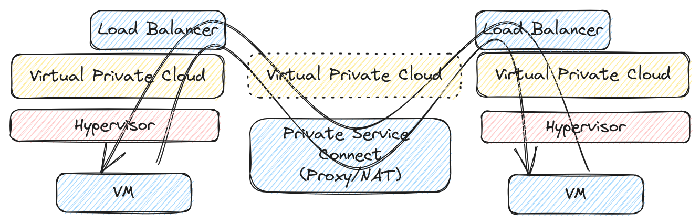
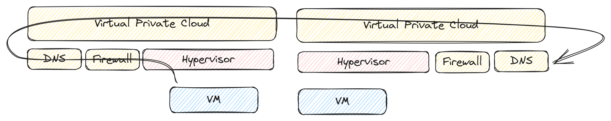

# Google Cloud Networking

This repository contains the diagrams I've presented on the [Xebia XKE on 2023-08-15](https://xke.xebia.com/event/9qCwSiK5qHAQhYepFZkb/5Ycms9OVASi3fM4DChhM/gcp-networking-for-dummies).

## Diagrams

I've created all diagrams with [Excalidraw](https://excalidraw.com/).
The source has been embedded in each PNG and you can directly edit them by opening the file on the Excalidraw website.

## Source references

These diagrams have been created based on my personal experience with Google Cloud, combined with:

* [Public documentation](https://cloud.google.com/docs), most notably [VPC documentation](https://cloud.google.com/vpc/docs)
* Billing information (SKU details give a lot of hints on the underlying technologies)
* Published whitepapers by Google
* Public talks by Googlers
* Private talks with Googlers (for which any NDA clause has (long) been expired)

# The presentation

## The OSI model

## VM - Internet communication

## VM - VM communication

## VPC Peering

## DNS

## The full presentation

